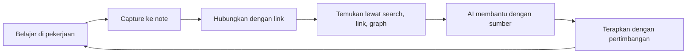

# Beranda Pengetahuan Planning
> **Intinya:** Knowledge kerja saya sebagai planner data center — konsep, lesson learned, dan satu project fiktif — saling terhubung supaya saya (dan tool AI saya) bisa menemukan dan memakainya lagi.

> [!info] Tentang vault ini
> Vault ini untuk demonstrasi. Konsep dan lesson learned ditulis sebagai note knowledge pribadi. **Project Alpha sepenuhnya fiktif** — semua contoh dan data project dibuat hanya untuk keperluan demonstrasi.

## 🧭 Mulai dari sini

- [[Informasi vs Knowledge]] — kenapa menyimpan file tidak sama dengan memahami sesuatu

## 📐 Planning & Scheduling

[[Planning & Scheduling MOC]] — inti dari pekerjaan saya.

- Logic dan analisis: [[Hubungan Antar Activity]] → [[Critical Path]] → [[Total Float]]
- Menjaga schedule tetap hidup: [[Baseline]] · [[Lookahead Planning]] · [[Constraints]]
- Saat ada masalah: [[Schedule Delay]] → [[Schedule Recovery]] → [[Acceleration]]

## 🏗️ Delivery Data Center

- Perjalanan menuju Ready for Service: [[Data Center Project Lifecycle]] → [[Commissioning]] ([[Commissioning Levels]] L1–L5) → [[Integrated Systems Testing]] → [[Handover]]

## 📊 Project Controls

- [[Forecasting]] · [[Pengecekan Kualitas Schedule]]

## 🧪 Project Alpha (kasus fiktif)

[[Gambaran Umum Project Alpha]] — potongan Data Hall 1 hipotetis untuk menguji ide.

- [[Project Alpha Schedule]] · [[Constraint Register]] · [[Weekly Planning - Week 14]]
- Activity utama: [[Electrical Equipment Installation - Area A]] di [[Area A - LV Electrical Room]]
- Catatan: [[Notulen Rapat Koordinasi Mingguan - Week 13]] · [[Issue Log]] · [[Decision Log]] · [[Project Alpha Lessons Learned]]

## 💡 Lessons Learned

Pengalaman yang diubah menjadi aturan yang bisa dipakai ulang.

- [[Cek Readiness Sebelum Mulai]]
- [[Schedule Paling Sering Pecah di Interface]]
- [[Terpasang Belum Tentu Commissioned]]
- [[Pantau Float, Bukan Hanya Tanggal]]

## 📥 Inbox

- [[Inbox]] — tempat catatan cepat dari lapangan sebelum dirapikan.

## Bagaimana knowledge mengalir di sini

