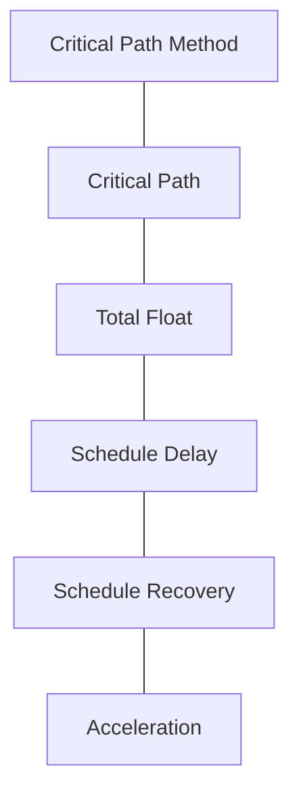

# Informasi vs Knowledge
> **Intinya:** Informasi adalah apa yang saya simpan; knowledge adalah apa yang bisa saya temukan, hubungkan, dan terapkan saat dibutuhkan.

Bagian dari [[Beranda Pengetahuan Planning]]

## Definisi

- **Informasi** — dokumen, catatan, atau pesan: export schedule, spesifikasi PDF, notulen rapat, thread email.
- **Knowledge** — pemahaman yang bisa saya *pakai*: kenapa float penting di path ini, apa yang harus dicek sebelum energization, apa yang salah terakhir kali dan bagaimana kami memperbaikinya.

Informasi berubah menjadi knowledge ketika sudah diinterpretasi, dihubungkan dengan ide lain, dan bisa ditemukan lagi tepat saat saya butuh.

## Kenapa Penting

Planner mengumpulkan informasi sepanjang hari — update, tracker, notulen, RFI, lesson learned. Sebagian besar berakhir di folder yang dinamai berdasarkan tanggal atau project. Enam bulan kemudian, masalahnya jarang *"saya belum pernah mempelajari ini"*; masalahnya *"saya tidak bisa menemukan di mana saya mempelajarinya."* Ingatan manusia cepat memudar kalau tidak diulang, jadi mengandalkan ingatan saja itu rapuh.

## Sudut Pandang Planner

| Penyimpanan file | Knowledge yang terhubung |
|---|---|
| Disusun berdasarkan *asalnya* (project, tanggal, pengirim) | Disusun berdasarkan *maknanya* (konsep, lesson learned) |
| Satu folder per file | Banyak link per ide |
| Cari berdasarkan nama file, kalau masih ingat | Navigasi lewat hubungan: CPM → Critical Path → Float → Delay → Recovery |
| Konteks ada di kepala saya | Konteks ditulis di samping idenya |

Rantai itu persis cara knowledge dihubungkan di vault ini: [[Critical Path]] ↔ [[Total Float]] ↔ [[Schedule Delay]] ↔ [[Schedule Recovery]] ↔ [[Acceleration]].

## Contoh Praktis

Di Project Alpha yang fiktif, instalasi Area A terhambat akses, padahal gambar, material, manpower, dan predecessor sudah ready. Sebagai *informasi*, itu hanya satu baris di [[Constraint Register]]. Sebagai *knowledge*, itu menjadi lesson learned [[Cek Readiness Sebelum Mulai]] — terhubung ke [[Constraints]] dan [[Lookahead Planning]] — yang bisa saya terapkan di activity berikutnya, di project mana pun.

## Kesalahan yang Sering Terjadi

- Menganggap "sudah saya simpan" sama dengan "saya tahu di mana letaknya".
- Membuat hierarki folder yang berlapis-lapis, bukan menghubungkan ide.
- Menulis lesson learned hanya saat close-out project, ketika detailnya sudah terlupa.
- Menyalin penjelasan yang sama ke banyak dokumen, sehingga tidak ada satu pun yang jadi acuan utama.

