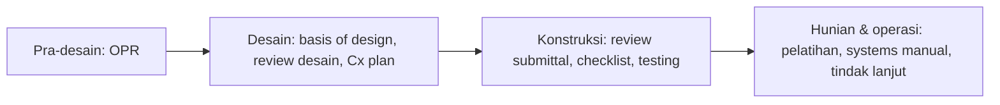

# Commissioning

> **Intinya:** Commissioning adalah proses yang berfokus pada kualitas untuk memverifikasi dan mendokumentasikan bahwa system di sebuah fasilitas sudah didesain, dipasang, dites dan mampu dioperasikan sesuai kebutuhan proyek owner — di data center, commissioning adalah bukti bahwa fasilitas sanggup memikul beban kritis.

Bagian dari [[Beranda Pengetahuan Planning]]

## Definisi

ASHRAE Guideline 0 (REF-021) menggambarkan commissioning sebagai sebuah proses, bukan satu kejadian: cara terstruktur untuk memverifikasi dan mendokumentasikan bahwa fasilitas dan system-nya memenuhi **Owner's Project Requirements (OPR)**. Scope-nya berjalan dari pra-desain sampai masa garansi. Fase-fasenya, seperti yang biasa saya lihat diterapkan:

Di proyek data center, testing di fase konstruksi biasanya dibagi menjadi [[Commissioning Levels]] L1 sampai L5, diakhiri dengan [[Integrated Systems Testing]].

## Kenapa Penting

Nilai sebuah data center ada pada kemampuannya menjaga beban IT tetap jalan saat utility padam, saat equipment gagal, dan saat maintenance. Kemampuan itu diklaim di desain dan hanya dibuktikan lewat commissioning. Karena itu Ready for Service adalah hasil commissioning, dan urutan commissioning adalah tempat di mana engineering, procurement, instalasi dan interface semuanya diuji sekaligus.

## Sudut Pandang Planner

Peran yang umum — penunjukan sebenarnya tergantung kontrak (misalnya, apakah commissioning agent ditunjuk oleh owner atau berada di dalam tim contractor):

| Peran | Tanggung jawab dalam commissioning |
|---|---|
| Owner | Menetapkan OPR; menerima hasilnya |
| Commissioning agent (CxA) | Menyusun commissioning plan, mereview script, menyaksikan tes, mengelola log issue, membuat laporan |
| Designer | Menjaga basis of design; menyelesaikan masalah desain yang ditemukan saat testing |
| Contractors | Memasang, melengkapi checklist, melaksanakan tes bersama CxA |
| Vendors | FAT, start-up, dukungan spesialis selama functional testing dan IST |
| Operations team | Ikut serta dalam testing dan pelatihan; nantinya menjalankan fasilitas |
| Planner | Memasukkan commissioning ke schedule dengan logic yang nyata dan memantau readiness |

Yang saya lakukan:

- Melibatkan CxA sejak activity commissioning pertama kali dijadwalkan, bukan saat sudah mau dimulai.
- Menjaga commissioning plan dan schedule tetap selaras — system sama, urutan sama, level sama.
- Memecah commissioning menjadi activity per system dan per level, dengan logic yang terhubung ke instalasi dan energization.
- Mereview log issue commissioning di rapat planning: issue yang masih terbuka adalah risiko schedule di masa depan.

## Contoh Praktis

Di [[Gambaran Umum Project Alpha|Project Alpha]], commissioning agent menyaksikan pressure test chilled water (A-4030) dan harus menyetujui script IST bersama perwakilan owner; keduanya tercatat di [[Constraint Register]]. Urutan commissioning berjalan dari start-up dan functional testing system elektrikal, mekanikal dan generator (A-5010, A-5020, A-5030) serta integrasi BMS/EPMS (A-5040), menuju Integrated Systems Testing (A-5050).

## Kesalahan yang Sering Terjadi

- Menganggap commissioning sebagai fase yang baru mulai setelah konstruksi selesai.
- Menunjuk CxA terlambat, sehingga tidak bisa lagi memengaruhi review desain dan script.
- Hanya satu summary bar "commissioning" tanpa logic di dalamnya.
- Staf operasi tidak dilibatkan sampai handover.
- Issue commissioning dicatat di spreadsheet yang tidak pernah dihubungkan ke schedule.

## Konsep Terkait

- [[Commissioning Levels]] — bagaimana commissioning di fase konstruksi dibagi bertahap.
- [[Integrated Systems Testing]] — level terakhir, untuk semua system.
- [[Handover]] — catatan commissioning dan pelatihan menjadi masukan handover.
- [[Terpasang Belum Tentu Commissioned]] — lesson learned di balik perlakuan commissioning sebagai jalur tersendiri.

## Referensi

- [[REF-021 ASHRAE Guideline 0 Commissioning Process|REF-021]] — proses commissioning, OPR, dan fase-fasenya dari pra-desain sampai operasi.
- [[REF-025 Data Center Commissioning Levels|REF-025]] — pembagian L1–L5 untuk commissioning fase konstruksi di data center.
