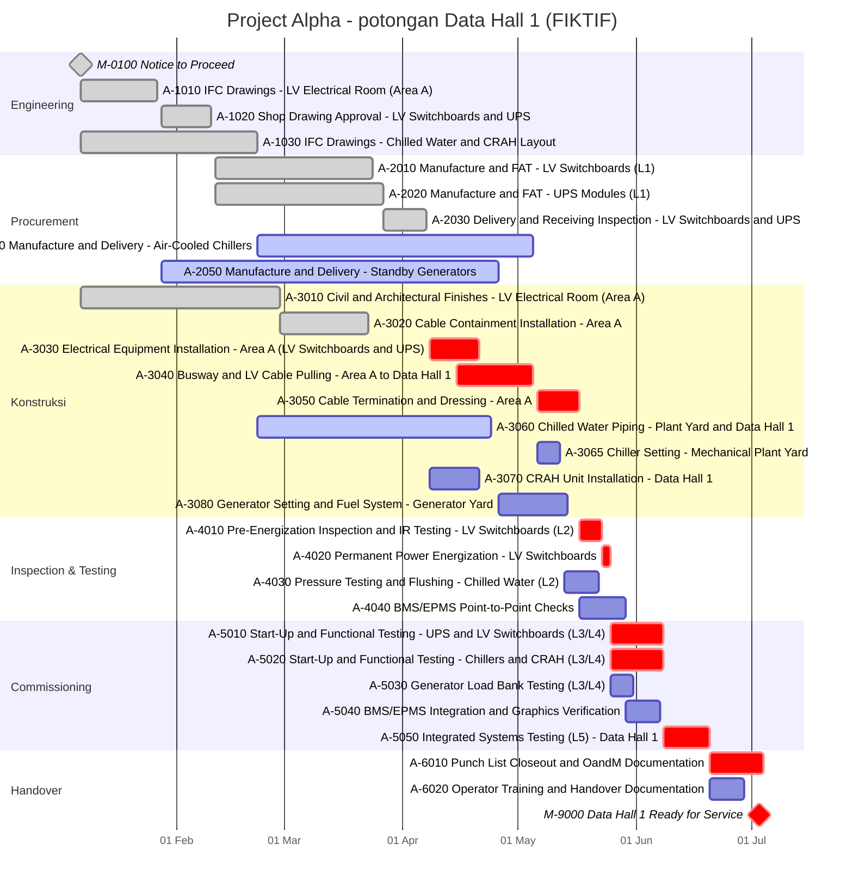

# Project Alpha Schedule

> [!warning] Data proyek fiktif
> Semua nama proyek, activity, tanggal, quantity, issue dan informasi proyek di Project Alpha adalah fiktif dan dibuat khusus untuk demonstrasi.

Bagian dari [[Gambaran Umum Project Alpha]]

Data date **2030-04-08** (Week 14). Total float dalam hari kerja terhadap baseline Ready for Service (2030-07-03).

## Critical Path
[[Electrical Equipment Installation - Area A|A-3030]] → A-3040 → A-3050 → A-4010 → A-4020 → A-5010 → A-5020 → A-5050 → A-6010 → M-9000

## Activity
| ID | Activity | Area | Start | Finish | Durasi (hk) | Total Float (hk) | Status | Progress |
|---|---|---|---|---|---|---|---|---|
| M-0100 | Notice to Proceed | Site-wide | 2030-01-07 | — | 0 | — | Complete | 100% |
| A-1010 | IFC Drawings — LV Electrical Room (Area A) | Area A | 2030-01-07 | 2030-01-26 | 18 | — | Complete | 100% |
| A-1020 | Shop Drawing Approval — LV Switchboards & UPS | Area A | 2030-01-28 | 2030-02-09 | 12 | — | Complete | 100% |
| A-1030 | IFC Drawings — Chilled Water & CRAH Layout | Area B | 2030-01-07 | 2030-02-21 | 40 | — | Complete | 100% |
| A-2010 | Manufacture & FAT — LV Switchboards (L1) | Off-site | 2030-02-11 | 2030-03-23 | 36 | — | Complete | 100% |
| A-2020 | Manufacture & FAT — UPS Modules (L1) | Off-site | 2030-02-11 | 2030-03-26 | 38 | — | Complete | 100% |
| A-2030 | Delivery & Receiving Inspection — LV Switchboards & UPS | Area A | 2030-03-27 | 2030-04-06 | 10 | — | Complete | 100% |
| A-2040 | Manufacture & Delivery — Air-Cooled Chillers | Off-site | 2030-02-22 | 2030-05-04 | 60 | 3 (near-critical) | In Progress | 60% |
| A-2050 | Manufacture & Delivery — Standby Generators | Off-site | 2030-01-28 | 2030-04-25 | 70 | 17 | In Progress | 77% |
| A-3010 | Civil & Architectural Finishes — LV Electrical Room (Area A) | Area A | 2030-01-07 | 2030-02-27 | 45 | — | Complete | 100% |
| A-3020 | Cable Containment Installation — Area A | Area A | 2030-02-28 | 2030-03-22 | 20 | — | Complete | 100% |
| [[Electrical Equipment Installation - Area A\|A-3030]] | Electrical Equipment Installation — Area A (LV Switchboards & UPS) | Area A | 2030-04-08 | 2030-04-20 | 12 | 0 (critical) | Not Started | 0% |
| A-3040 | Busway & LV Cable Pulling — Area A to Data Hall 1 | Area B | 2030-04-15 | 2030-05-04 | 18 | 0 (critical) | Not Started | 0% |
| A-3050 | Cable Termination & Dressing — Area A | Area A | 2030-05-06 | 2030-05-16 | 10 | 0 (critical) | Not Started | 0% |
| A-3060 | Chilled Water Piping — Plant Yard & Data Hall 1 | Area C | 2030-02-22 | 2030-04-23 | 50 | 8 | In Progress | 72% |
| A-3065 | Chiller Setting — Mechanical Plant Yard | Area C | 2030-05-06 | 2030-05-11 | 6 | 3 (near-critical) | Not Started | 0% |
| A-3070 | CRAH Unit Installation — Data Hall 1 | Area B | 2030-04-08 | 2030-04-20 | 12 | 23 | Not Started | 0% |
| A-3080 | Generator Setting & Fuel System — Generator Yard | Area D | 2030-04-26 | 2030-05-13 | 15 | 17 | Not Started | 0% |
| A-4010 | Pre-Energization Inspection & IR Testing — LV Switchboards (L2) | Area A | 2030-05-17 | 2030-05-22 | 5 | 0 (critical) | Not Started | 0% |
| A-4020 | Permanent Power Energization — LV Switchboards | Area A | 2030-05-23 | 2030-05-24 | 2 | 0 (critical) | Not Started | 0% |
| A-4030 | Pressure Testing & Flushing — Chilled Water (L2) | Area C | 2030-05-13 | 2030-05-21 | 8 | 3 (near-critical) | Not Started | 0% |
| A-4040 | BMS/EPMS Point-to-Point Checks | Area B | 2030-05-17 | 2030-05-28 | 10 | 1 (near-critical) | Not Started | 0% |
| A-5010 | Start-Up & Functional Testing — UPS & LV Switchboards (L3/L4) | Area A | 2030-05-25 | 2030-06-07 | 12 | 0 (critical) | Not Started | 0% |
| A-5020 | Start-Up & Functional Testing — Chillers & CRAH (L3/L4) | Area C | 2030-05-25 | 2030-06-07 | 12 | 0 (critical) | Not Started | 0% |
| A-5030 | Generator Load Bank Testing (L3/L4) | Area D | 2030-05-25 | 2030-05-30 | 5 | 7 | Not Started | 0% |
| A-5040 | BMS/EPMS Integration & Graphics Verification | Area B | 2030-05-29 | 2030-06-06 | 8 | 1 (near-critical) | Not Started | 0% |
| A-5050 | Integrated Systems Testing (L5) — Data Hall 1 | Area B | 2030-06-08 | 2030-06-19 | 10 | 0 (critical) | Not Started | 0% |
| A-6010 | Punch List Closeout & O&M Documentation | Site-wide | 2030-06-20 | 2030-07-03 | 12 | 0 (critical) | Not Started | 0% |
| A-6020 | Operator Training & Handover Documentation | Site-wide | 2030-06-20 | 2030-06-28 | 8 | 4 (near-critical) | Not Started | 0% |
| M-9000 | Data Hall 1 Ready for Service | Area B | — | 2030-07-03 | 0 | 0 (critical) | Not Started | 0% |

## Logic
| ID | Predecessor | Successor |
|---|---|---|
| M-0100 | — | A-1010 FS; A-1030 FS; A-3010 FS |
| A-1010 | M-0100 FS | A-1020 FS; A-2050 FS |
| A-1020 | A-1010 FS | A-2010 FS; A-2020 FS; A-3030 FS |
| A-1030 | M-0100 FS | A-2040 FS; A-3060 FS; A-3070 FS |
| A-2010 | A-1020 FS | A-2030 FS |
| A-2020 | A-1020 FS | A-2030 FS |
| A-2030 | A-2010 FS; A-2020 FS | A-3030 FS |
| A-2040 | A-1030 FS | A-3065 FS |
| A-2050 | A-1010 FS | A-3080 FS |
| A-3010 | M-0100 FS | A-3020 FS |
| A-3020 | A-3010 FS | A-3030 FS |
| [[Electrical Equipment Installation - Area A\|A-3030]] | A-1020 FS; A-2030 FS; A-3020 FS | A-3040 SS+6 |
| A-3040 | A-3030 SS+6 | A-3050 FS |
| A-3050 | A-3040 FS | A-4010 FS; A-4040 FS |
| A-3060 | A-1030 FS | A-3065 SS+10; A-3070 SS+15; A-4030 FS |
| A-3065 | A-2040 FS; A-3060 SS+10 | A-4030 FS |
| A-3070 | A-1030 FS; A-3060 SS+15 | A-4040 FS; A-5020 FS |
| A-3080 | A-2050 FS | A-5030 FS |
| A-4010 | A-3050 FS | A-4020 FS |
| A-4020 | A-4010 FS | A-5010 FS; A-5020 FS; A-5030 FS |
| A-4030 | A-3060 FS; A-3065 FS | A-5020 FS |
| A-4040 | A-3050 FS; A-3070 FS | A-5040 FS |
| A-5010 | A-4020 FS | A-5040 SS+3; A-5050 FS |
| A-5020 | A-4030 FS; A-3070 FS; A-4020 FS | A-5050 FS |
| A-5030 | A-3080 FS; A-4020 FS | A-5050 FS |
| A-5040 | A-4040 FS; A-5010 SS+3 | A-5050 FS |
| A-5050 | A-5010 FS; A-5020 FS; A-5030 FS; A-5040 FS | A-6010 FS; A-6020 FS |
| A-6010 | A-5050 FS | M-9000 FS |
| A-6020 | A-5050 FS | M-9000 FS |
| M-9000 | A-6010 FS; A-6020 FS | — |

## Tampilan Gantt
_Mermaid menggambar dalam hari kalender; schedule-nya sendiri memakai kalender kerja enam hari._

## Interpretasi

- Critical path berjalan dari instalasi Area A, lalu cabling, inspection dan energization, sampai ke commissioning dan handover. Lihat [[Critical Path]].
- Functional testing mekanikal ada di path yang sama karena butuh permanent power. Ini dependency lintas disiplin yang mudah terlewat kalau setiap trade hanya mereview activity-nya sendiri. Lihat [[Hubungan Antar Activity]].
- Path generator menunjukkan bagaimana keterlambatan supplier bisa memakan [[Total Float]] tanpa menggeser tanggal finish. Lihat [[Pantau Float, Bukan Hanya Tanggal]].
- Activity commissioning terlihat singkat di atas kertas, tapi prerequisite-nya paling banyak. Lihat [[Commissioning]] dan [[Integrated Systems Testing]].
