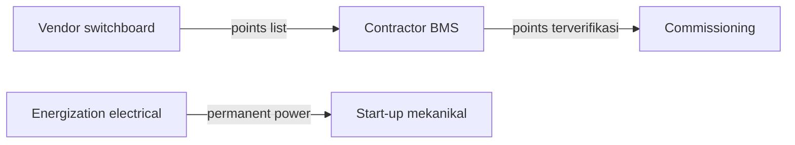

# Schedule Paling Sering Pecah di Interface
> **Intinya:** Delay jarang berawal di dalam satu paket pekerjaan; delay berawal di celah antar paket, tempat tidak ada yang jelas memiliki deliverable-nya.

Bagian dari [[Beranda Pengetahuan Planning]]

## Pelajarannya

Setiap contractor atau vendor biasanya merencanakan scope-nya sendiri dengan baik. Yang terlewat adalah serah terima *antar* scope: points list antara vendor switchboard dan contractor BMS, scaffold yang menutup jalur trade lain, batas kabel antara dua installer, permanent power yang dibutuhkan tim mekanikal. Item seperti ini sering tidak punya activity di schedule siapa pun.

## Kenapa Berlaku di Project Lain

- Interface bukan scope utama siapa pun, jadi juga bukan prioritas utama siapa pun.
- Interface muncul terlambat — biasanya saat integrasi atau testing, ketika float sudah tipis.
- Data center memang sarat interface: sistem electrical, mechanical, dan controls harus bekerja *bersama* sebelum handover.

## Asal Pelajaran Ini

Di Project Alpha yang fiktif, EPMS points list antara vendor switchboard dan contractor BMS belum disepakati saat point-to-point check sudah dekat (lesson L-003, issue I-005), dan scaffold fasad menutup jalur rigging electrical (issue I-001). Lihat [[Project Alpha Lessons Learned]] dan [[Issue Log]].

## Cara Saya Menerapkannya

1. **Beri nama interface** sebagai deliverable: "EPMS points list disepakati", bukan "koordinasi".
2. **Tetapkan owner-nya** dan tanggal required-by di constraint register (kategori: *Interface*).
3. **Modelkan dependensinya** di schedule kalau memang menggerakkan pekerjaan — misalnya functional testing mekanikal yang bergantung pada permanent power.
4. **Ajukan pertanyaan lintas trade** di rapat koordinasi: "Apa yang Anda butuhkan dari pihak lain dalam enam minggu ke depan?"

## Konsep Terkait

- [[Constraints]] — interface adalah salah satu kategori readiness
- [[Hubungan Antar Activity]] — sebagian interface layak dibuatkan link logic yang eksplisit
- [[Integrated Systems Testing]] — tempat interface yang belum beres akhirnya terbongkar

## Referensi

Tidak ada sumber eksternal yang dikutip; ini lesson learned dari praktik pribadi yang diambil dari kasus fiktif.
