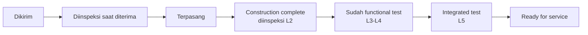

# Terpasang Belum Tentu Commissioned
> **Intinya:** Sudah dikirim belum tentu terpasang, sudah terpasang belum tentu sudah dites, dan sudah dites belum tentu ready for service — setiap tahap butuh waktu, bukti, dan pelaporannya sendiri.

Bagian dari [[Beranda Pengetahuan Planning]]

## Pelajarannya

Laporan progress suka sekali dengan kata "complete". Di project data center, equipment melewati beberapa status yang berbeda sebelum punya nilai apa pun bagi owner:

Setiap panah menyembunyikan pekerjaan: inspeksi penerimaan, perbaikan kerusakan, terminasi, inspeksi, energization, start-up, functional test, integrated test, dokumentasi. Kalau yang dilaporkan hanya "terpasang", project terlihat lebih dekat ke finish daripada kenyataannya.

## Kenapa Berlaku di Project Lain

- Instalasi fisik terlihat; testing dan dokumentasi tidak — jadi keduanya sering diremehkan.
- Defect yang ditemukan terlambat (saat start-up atau integrated testing) mahal diperbaiki dan sulit dijadwalkan.
- Owner mengukur keberhasilan di *ready for service*, bukan di *terpasang*.

## Asal Pelajaran Ini

Di Project Alpha yang fiktif, pintu panel UPS yang rusak ditemukan saat inspeksi penerimaan, tidak lama sebelum instalasi (lesson L-004, issue I-006). Perbaikannya masih sempat — tapi memakan margin yang tidak pernah direncanakan secara eksplisit oleh siapa pun. Lihat [[Project Alpha Lessons Learned]].

## Cara Saya Menerapkannya

- Jadwalkan inspeksi penerimaan dan perbaikan sebagai activity atau allowance yang eksplisit.
- Laporkan progress berdasarkan status (dikirim / terpasang / L2 / L3-L4 / L5), bukan hanya persentase complete.
- Anggap "sudah dikirim tapi belum diinspeksi" sebagai constraint *material* dalam readiness check.
- Selaraskan aturan progress measurement dengan level commissioning.

## Konsep Terkait

- [[Commissioning Levels]] — tangga L1–L5 di balik diagram di atas
- [[Handover]] — garis finish yang sebenarnya penting
- [[Cek Readiness Sebelum Mulai]] — readiness material termasuk inspeksi

## Referensi

- [[REF-021 ASHRAE Guideline 0 Commissioning Process|REF-021]] — commissioning sebagai proses mutu untuk memverifikasi bahwa sistem memenuhi persyaratan project
